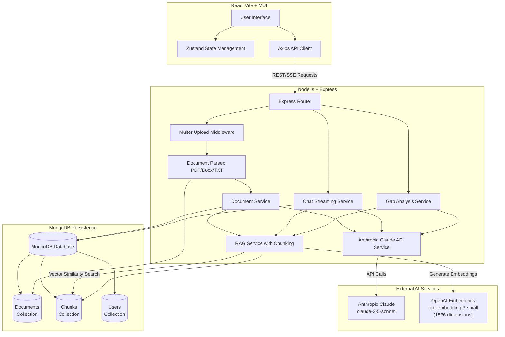

# System Architecture

The AI-Powered Compliance Document Analyzer is built as a modern, full-stack monorepo utilizing Turborepo to manage frontend and backend applications.

## Architecture Diagram

## Detailed Explanation

### 1. Frontend (React 18 + Vite)

- **User Interface:** Built with Material-UI (MUI) v6 for a clean, responsive, and accessible enterprise design.
- **State Management:** Zustand manages global state, such as the currently active documents, user session (mock auth), and chat history.
- **Communication:** Axios is used to communicate with the backend REST API; supports both standard requests and Server-Sent Events (SSE) for streaming chat responses.

### 2. Backend (Node.js + Express)

#### Document Ingestion Pipeline

1. **File Upload & Parsing:** Multer handles file uploads. The Parser Service uses:
   - `pdf-parse` for PDF extraction
   - `mammoth` for DOCX/DOC extraction
   - Native Node.js buffering for plain text files
   - Extracted text is passed to the Document Service for processing

2. **AI-Powered Enrichment:** Claude API processes raw text to:
   - Generate a document summary
   - Extract key topics/compliance keywords
   - Metadata is stored in MongoDB with the original document

3. **Hybrid Chunking Strategy (RAG Service):**
   - **Semantic Chunking:** Splits text on double-newlines (paragraph boundaries) to preserve content structure
   - **Fixed-Size Batching:** Groups chunks into ~1000-character blocks with 200-character overlaps to maintain context
   - **Embedding Generation:** OpenAI `text-embedding-3-small` model generates 1536-dimensional embeddings for each chunk
     - Batches embeddings in groups of 20 for efficiency
     - **Graceful Fallback:** If `OPENAI_API_KEY` is unavailable, falls back to TF-IDF keyword scoring for retrieval
   - **Persistence:** All chunks and embeddings are stored in MongoDB for later retrieval

#### Chat & Q&A System

- **Streaming Architecture:** Chat queries are delivered via Server-Sent Events (SSE) for real-time token streaming
- **Retrieval Flow:**
  1. User submits a query with optional document scope
  2. RAG Service retrieves top-5 most relevant chunks using vector similarity (OpenAI embeddings) or keyword matching (fallback)
  3. Sources metadata (section, page number, text snippets) are sent first to the frontend
  4. Claude processes the query with full context and citations are enforced in the prompt
  5. Response tokens stream one-by-one to the frontend as `data:` SSE events
- **Citation Handling:** Each retrieved chunk includes source metadata (section, page number) which Claude incorporates into citations

#### Gap Analysis Service

- Orchestrates a specialized workflow comparing two documents:
  1. Retrieves relevant chunks from the Standard document (e.g., "Recognised-Standard-RS-OSHEM-001")
  2. Retrieves relevant chunks from the Procedure document (e.g., "ACME-Site-Procedure-SSP-001")
  3. Passes both sets of chunks to Claude with a structured prompt to identify compliance gaps
  4. Structures findings into a Gap Analysis report with:
     - Gap classification (Full Gap, Partial Gap, Full Compliance)
     - Severity levels (High, Medium, Low)
     - Recommendations for remediation

### 3. External AI Services

#### Anthropic Claude

- **Model:** `claude-3-5-sonnet`
- **Purpose:**
  - Document summarization and topic extraction during ingestion
  - Q&A and chat responses with RAG-augmented context
  - Gap analysis and compliance comparison
  - Generates structured JSON output for compliance findings

#### OpenAI Embeddings

- **Model:** `text-embedding-3-small` (1536 dimensions)
- **Purpose:** Generates dense vector representations of document chunks for semantic similarity search
- **Fallback:** If `OPENAI_API_KEY` is not provided:
  - RAG Service falls back to TF-IDF keyword scoring
  - Tokenizes queries and counts term occurrences in chunks
  - Ranking is less precise but system remains fully functional

### 4. MongoDB Persistence

**Database:** MongoDB with Mongoose ORM (connection via `MONGODB_URI` environment variable)

**Collections:**

- **documents:** Stores DocumentMetadata (original name, MIME type, size, summary, topics, upload date, compliance category)
- **chunks:** Stores DocumentChunk objects with:
  - Raw text content
  - 1536-dimensional OpenAI embeddings (or empty vectors if OpenAI unavailable)
  - Metadata (document ID, section, subsection, page number, topics, compliance category)
- **users:** Stores user credentials (currently seeded with `admin`/`admin123` for demo purposes)

**Graceful Degradation:** If MongoDB is unavailable (e.g., `MONGODB_URI` not set or connection fails):

- App logs a warning but continues operation
- Falls back to in-memory storage for that session
- All features remain functional

### 5. Shared Packages

- **`packages/shared`:** Contains TypeScript interfaces, type definitions, and common utilities shared between the frontend and backend (e.g., API request/response types, Gap Analysis schemas, DocumentMetadata) to ensure end-to-end type safety.
