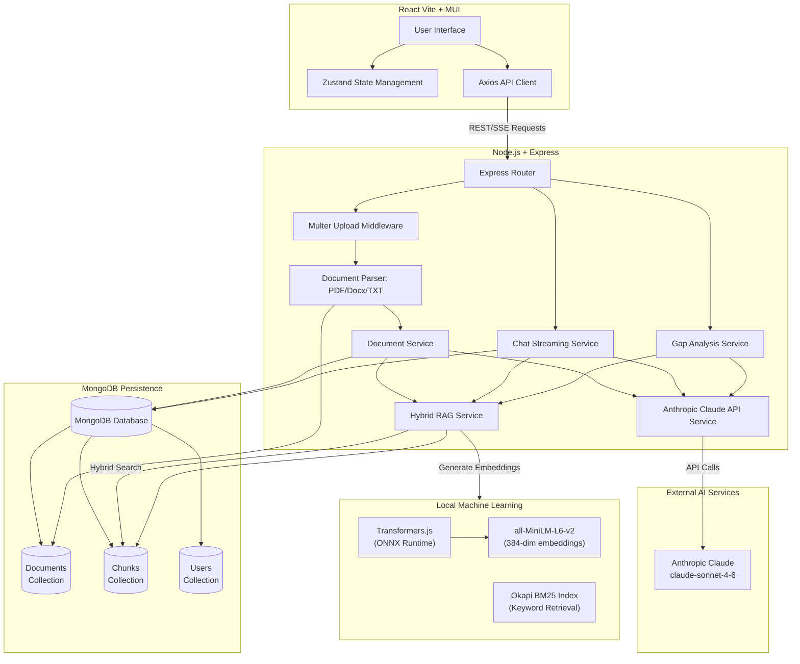

# System Architecture

The AI-Powered Compliance Document Analyzer is built as a modern, full-stack monorepo utilizing Turborepo to manage frontend and backend applications.

## Architecture Diagram

## Detailed Explanation

### 1. Frontend (React 18 + Vite)

- **User Interface:** Built with Material-UI (MUI) v6 for a clean, responsive, and accessible enterprise design.
- **State Management:** Zustand manages global state, such as the currently active documents, user session (mock auth), and chat history.
- **Communication:** Axios is used to communicate with the backend REST API; supports both standard requests and Server-Sent Events (SSE) for streaming chat responses.

### 2. Backend (Node.js + Express)

#### Document Ingestion Pipeline

1. **File Upload & Parsing:** Multer handles file uploads. The Parser Service uses:
   - `pdf-parse` for PDF extraction
   - `mammoth` for DOCX/DOC extraction
   - Native Node.js buffering for plain text files
   - Extracted text is passed to the Document Service for processing

2. **AI-Powered Enrichment:** Claude API processes raw text to:
   - Generate a document summary
   - Extract key topics/compliance keywords
   - Metadata is stored in MongoDB with the original document

3. **Hybrid Chunking Strategy (RAG Service):**
   - **Semantic Chunking:** Splits text on double-newlines (paragraph boundaries) to preserve content structure
   - **Fixed-Size Batching:** Groups chunks into ~1000-character blocks with 200-character overlaps to maintain context
   - **Local Embedding Generation:** Uses Transformers.js with `all-MiniLM-L6-v2` to generate 384-dimensional embeddings (zero API cost)
   - **BM25 Indexing:** Pre-computes term frequencies and document lengths for statistical keyword retrieval
   - **Persistence:** All chunks, embeddings, and BM25 metadata are stored in MongoDB

#### Multi-Stage Hybrid RAG System

The retrieval pipeline mirrors industry best-in-class architectures (like Elasticsearch Hybrid Search or Cohere Rerank):

1. **Query Expansion:** Claude generates synonyms and alternate technical phrasings to improve recall
2. **BM25 Retrieval:** Okapi BM25 scores chunks based on statistical term frequency/inverse document frequency (TF-IDF)
3. **Dense Vector Retrieval:** Cosine similarity search using the local 384-dim sentence embeddings
4. **Reciprocal Rank Fusion (RRF):** Mathematically merges the rankings from BM25 and Vector Search
5. **Cross-Encoder Reranking:** Claude scores the top candidates for final contextual relevance

#### Chat & Q&A System

- **Streaming Architecture:** Chat queries are delivered via Server-Sent Events (SSE) for real-time token streaming
- **Retrieval Flow:** Uses the multi-stage Hybrid RAG system described above
- **Citation Handling:** Each retrieved chunk includes source metadata (section, page number) which Claude incorporates into citations

#### Gap Analysis Service

- Orchestrates a specialized workflow comparing two documents:
  1. Retrieves all chunks from the Standard document
  2. Retrieves all chunks from the Procedure document
  3. Passes both sets of chunks to Claude with a structured prompt to identify compliance gaps
  4. Structures findings into a Gap Analysis report

### 3. External AI Services

#### Anthropic Claude

- **Model:** `claude-sonnet-4-6`
- **Purpose:**
  - Document summarization and topic extraction
  - Q&A and chat responses with RAG-augmented context
  - Gap analysis and compliance comparison
  - Query expansion and cross-encoder reranking

### 4. Local Machine Learning

- **Transformers.js:** Runs ONNX models directly in the Node.js backend
- **Model:** `Xenova/all-MiniLM-L6-v2`
- **Purpose:** Generates dense vector embeddings locally. This provides zero-latency, zero-cost semantic search capabilities without relying on external APIs like OpenAI.

### 5. MongoDB Persistence

**Database:** MongoDB with Mongoose ORM (connection via `MONGODB_URI` environment variable)

**Collections:**

- **documents:** Stores DocumentMetadata (original name, MIME type, size, summary, topics, upload date, compliance category)
- **chunks:** Stores DocumentChunk objects with:
  - Raw text content
  - 384-dimensional dense embeddings
  - BM25 term frequency maps and token counts
  - Metadata (document ID, section, subsection, page number, topics, compliance category)
- **users:** Stores user credentials (currently seeded with `admin`/`admin123` for demo purposes)
