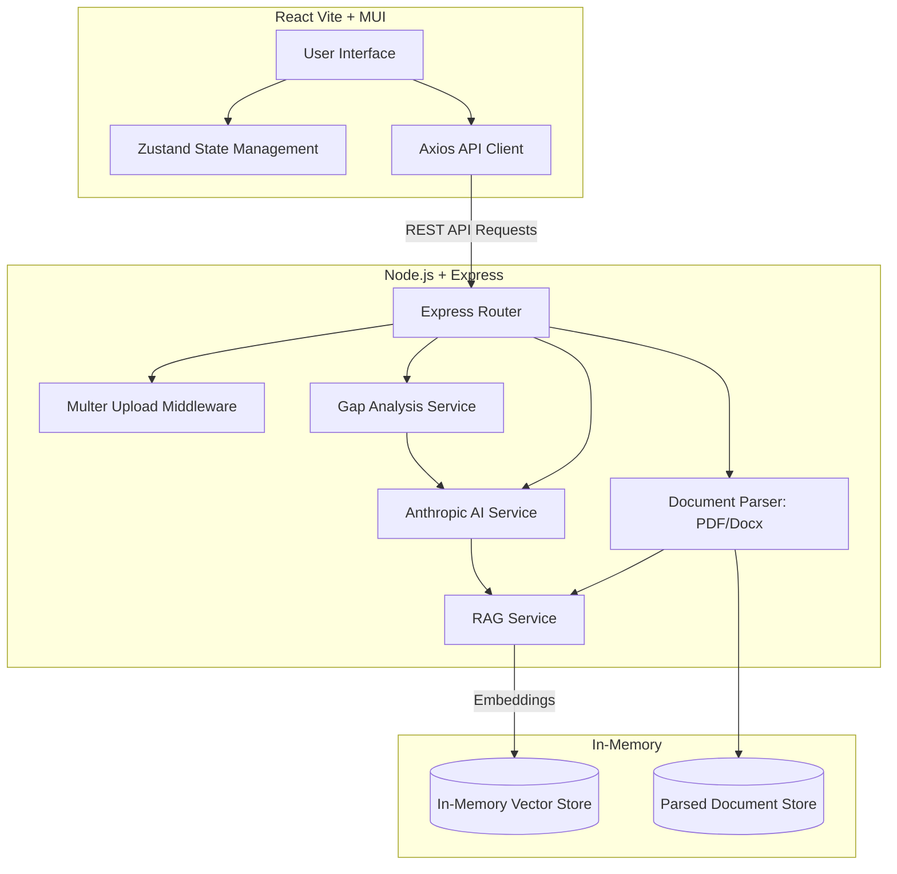

# System Architecture

The AI-Powered Compliance Document Analyzer is built as a modern, full-stack monorepo utilizing Turborepo to manage frontend and backend applications.

## Architecture Diagram

## Detailed Explanation

### 1. Frontend (React 18 + Vite)
- **User Interface:** Built with Material-UI (MUI) v6 for a clean, responsive, and accessible enterprise design.
- **State Management:** Zustand manages global state, such as the currently active documents, user session (mock auth), and chat history.
- **Communication:** Axios is used to communicate with the backend REST API.

### 2. Backend (Node.js + Express)
- **Document Ingestion:** Uses Multer for handling file uploads. `pdf-parse` and `mammoth` extract raw text from PDFs and DOCX files.
- **RAG Pipeline:** The extracted text is passed to the RAG Service, which applies a hybrid chunking strategy and generates embeddings (using Claude or a compatible local model) before storing them in an in-memory vector store.
- **AI Service:** Wraps the Anthropic SDK, managing communication with the `claude-3-5-sonnet-20241022` model. It handles prompt construction, context window management, and structured output parsing.
- **Gap Analysis Service:** A specialized orchestration layer that retrieves relevant chunks from both an ACME Site Procedure and a Recognised Standard, compares them using the AI Service, and formats the output into a structured gap report.

### 3. Shared Packages
- **`packages/shared`:** Contains TypeScript interfaces, type definitions, and common utilities shared between the frontend and backend (e.g., API request/response types, Gap Analysis schemas) to ensure end-to-end type safety.
